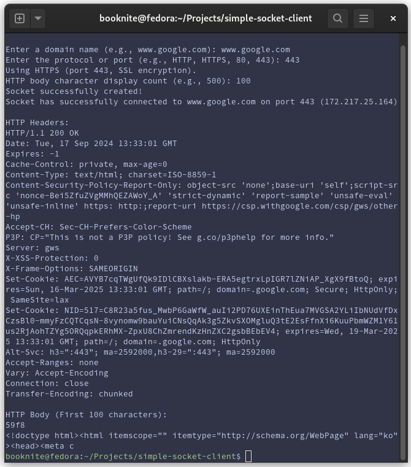

# Simple HTTP/HTTPS Socket Client

This project is a basic HTTP and HTTPS client built using sockets. It can connect to web servers, send requests, and receive responses over both HTTP and HTTPS.



## Purpose

The goal of this project is to show how to create a basic network client using Python's socket library.
This script can:

* Establish a connection to a web server.
* Handle HTTP (port 80) and HTTPS (port 443) protocols.
* Send a simple GET request and retrieve the response.
* Display HTTP headers and a portion of the response body (entered by the user).

## How It Works

- Input a domain name (e.g., www.google.com).
- Select the port/protocol (e.g., 443 or HTTPS)
- The script connects to the server using the selected protocol (with SSL encryption for HTTPS).
- After sending a GET request, it splits the response into headers and body, then prints them in the terminal.

## What Can Be Learned From the Output

Inspecting headers:

- **Status codes** show if the requests was successful (e.g., 200 OK).
- **Content-Type**: tells you what kind of data the server is sending (HTML, JSON, etc.).
- **Security headers** tell you about the server's security practices like `Content-Security-Policy`, `X-Frame-Options`, etc.

Inspecting the body:

```html
<!doctype html><html itemscope="" itemtype="http://schema.org/WebPage" lang="ko"><head><meta content="text/html; charset=UTF-8" http-equiv="Content-Type"><meta content="/images/branding/googleg/1x/googleg_standard_color_128dp.png" itemprop="image"><title>Google</title><script nonce="gRSsJykcC2TGMdxWgC1rew">(function(){var _g={kEI:'cWbpZpOEN9DZ1e8PzZLbmQU',kEXPI:'0,18168,3682138,643,432,3,48,447833,90780,2872,2891,73050,6397,9708,203622,6700,41942,57740,2,2,1,26632,8155,23351,7450,14985,977
```

This small snippet shows:
* The document type (<!doctype html>)
* The page is in Korean (lang="ko")
* Meta information about content type and character encoding
* The title of the page (<title>Google</title>)

## Notes

Writing the script I ran into a few problems.

1.`ssl.wrap_socket()`was deprecated after Python 3.7, so I switched to using SSLContext to handle HTTPS connections.

2. Printing the entire HTTP body for large websites could flood the terminal, so I added a feature to limit the number of characters displayed.
